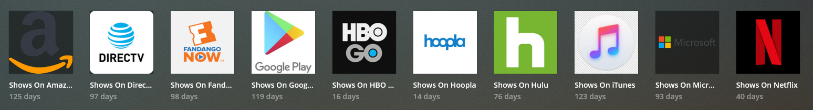

# plex-justwatch-webhook

Have you ever wanted to organize playlists on your Plex Media Server based on which streaming providers offers your movies/shows?

This service searches for which streaming platform offers each of your movies/shows, and then organizes your media into streaming platform-specific playlists:




To get started:

```bash
git clone https://github.com/austin-millan/plex-flask-webhook.git
```

Copy the `.env-example` file to `.env`, and then update it to match your environment.

## Environment Variables (Required)

- PLEX_TOKEN
  - String
- PLEX_BASE_URL
  - String
- PLEX_ACCOUNT_USER
  - String
- UPDATE_USER_PLAYLISTS
  - 'y' or 'n'
- BLACKLISTED_USERS
  - String, list/array
- SYNC_EXISTING_LIBRARIES
  - 'y' or 'n'
- PRE_CLEAR_PLAYLISTS
  - 'y' or 'n'
- MOVIES_LIBRARY
  - String
- SHOWS_LIBRARY
  - String

## Run Locally

```bash
pip3 install flask
pip3 install plexapi
pip3 install pylogrus
pip3 install plexapi
pip3 install justwatch
python3 plex_justwatch/plex_justwatch.py
```

## Run With Docker

```bash
./build.sh
./run.sh
```

## Run With docker-compose

First, make sure you buld the Docker image:

```bash
./build.sh
```

```yml
version: '3.3'
services:
  plex-justwatch-webhook:
    image: aamillan/plex-justwatch-webhook:latest
    container_name: plex-justwatch-webhook
    environment:
      - TZ="America/Los_Angeles"
      - PUID=1000
      - PGID=1000
      - PLEX_TOKEN=YOUR_TOKEN
      - PLEX_BASE_URL=YOUR_PLEX_URL
      - PLEX_ACCOUNT_USER=YOUR_EMAIL
      - UPDATE_USER_PLAYLISTS=y
      - BLACKLISTED_USERS=SOME_USER
      - SYNC_EXISTING_LIBRARIES=y
      - MOVIES_LIBRARY=Movies
      - SHOWS_LIBRARY=TV Shows
    ports:
      - 5000:5000
    restart: always
```

Then use the above configuration in your `docker-compose.yml` file, and bring it up by running:

```bash
docker-compose up -d plex-justwatch-webhook
```

## Repository Views

[](http://hits.dwyl.com/austin-millan/plex-justwatch-webhook)

